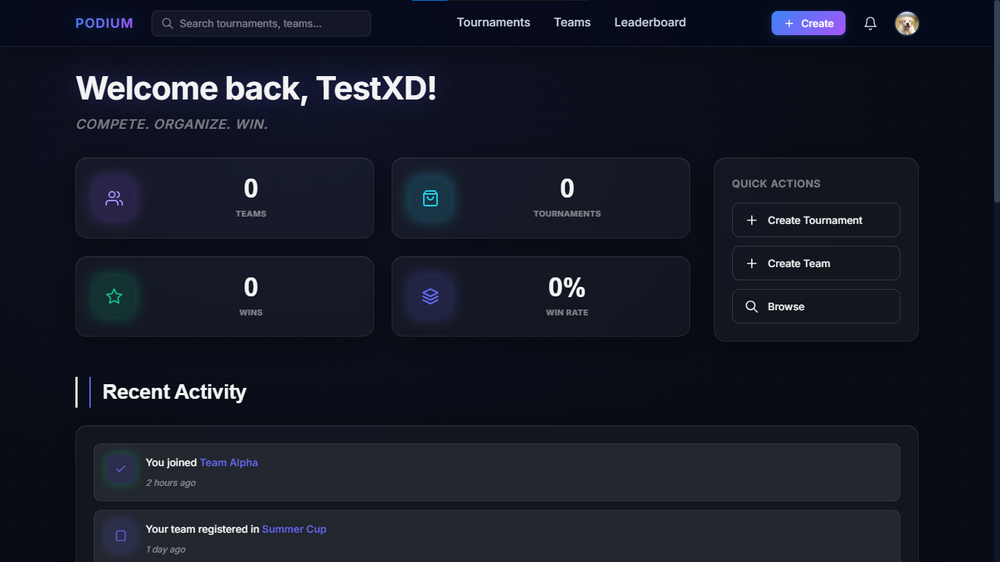
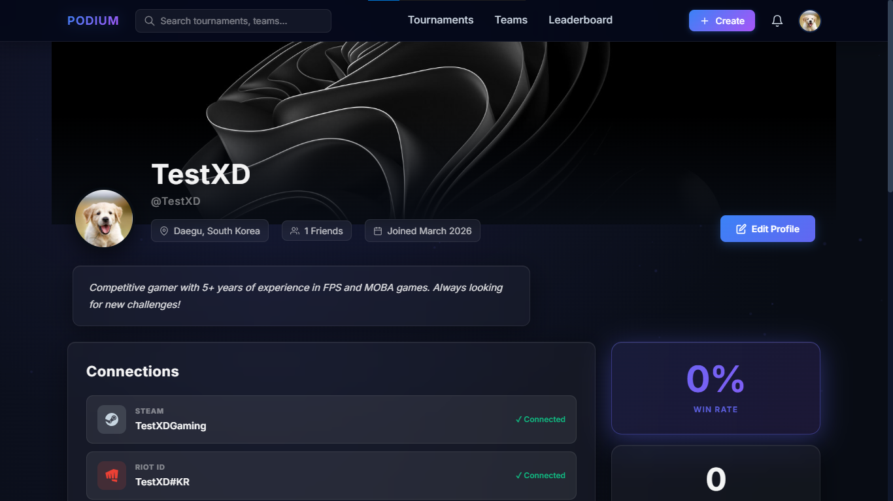
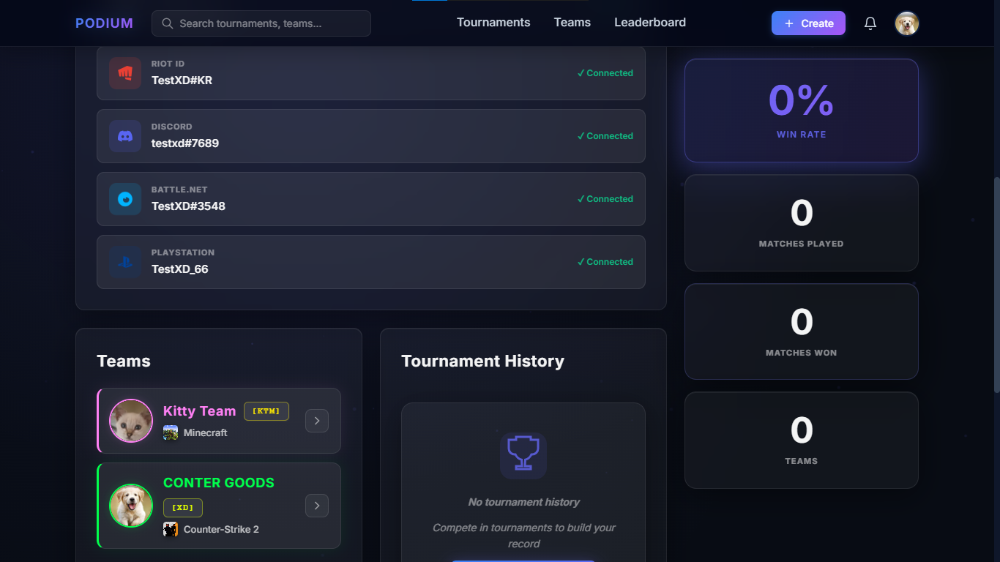
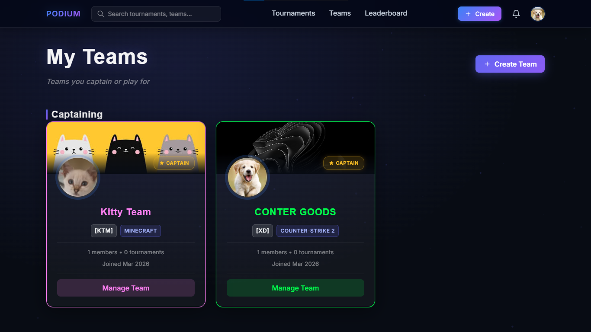
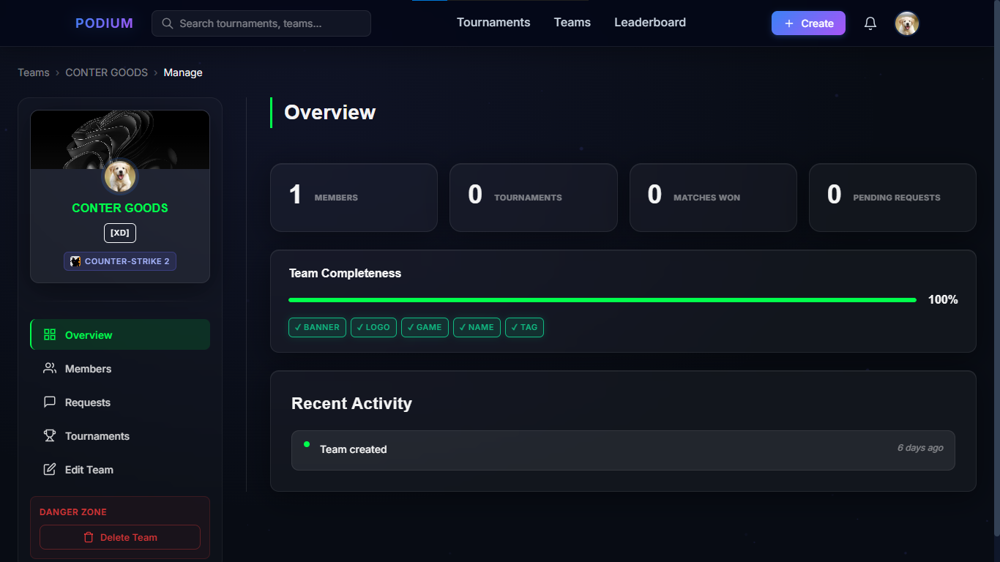
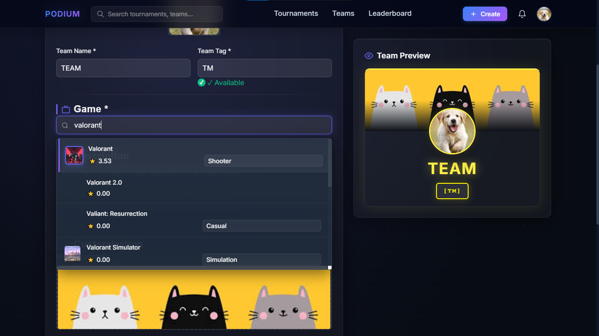
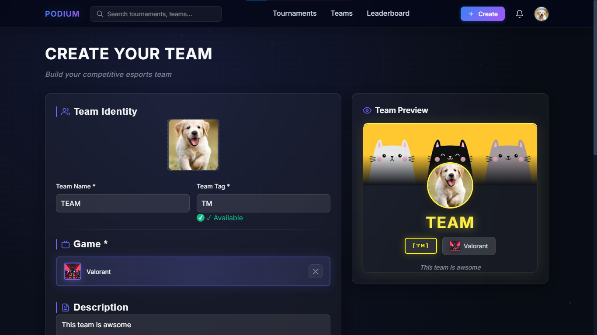

# 🎮 Podium - Proyecto de Práctica React + Django

⭐ **Si te gusta este proyecto, considera darle una estrella!**

Proyecto de práctica full-stack para aprender React y Django REST Framework, con la idea inicial de crear una plataforma de torneos esports.

**Stack:** Django REST Framework + React + WebSockets

---

## 📸 Screenshots

<div align="center">

### Captura 1


### Captura 2


### Captura 3


### Captura 4


### Captura 5


### Captura 6


### Captura 7


### Captura 8


### Captura 9


</div>

---

## ⚠️ Estado del Proyecto

Este proyecto fue creado principalmente como **práctica de React y Django**. Está **incompleto** y no tiene planes inmediatos de continuación.

**Lo que funciona:**
- ✅ Sistema de usuarios y autenticación
- ✅ Perfiles públicos con avatares
- ✅ Gestión de equipos
- ✅ Sistema de amigos
- ✅ Notificaciones en tiempo real (WebSockets)

**Lo que NO está implementado:**
- ❌ Sistema completo de torneos
- ❌ Brackets y partidas
- ❌ Registro de resultados
- ❌ Estadísticas y rankings

**Siéntete libre de usar este código incompleto** si te sirve para aprender o como base para tu propio proyecto. No hay garantía de actualizaciones futuras.

---

## � Propósito del Proyecto

Este proyecto nació como una forma de **practicar React** y aprender a integrar un frontend moderno con Django REST Framework.

La idea original era crear una plataforma de torneos esports, pero quedó como un proyecto de aprendizaje con funcionalidades básicas implementadas:

- Sistema de autenticación y usuarios
- CRUD de equipos con roles
- Sistema social (amigos)
- WebSockets para notificaciones
- Integración con API externa (RAWG)

Es un buen ejemplo de arquitectura full-stack, pero **no es un producto terminado**.

---

## 🚀 Quick Start

### Prerrequisitos

- Python 3.10+
- Node.js 18+
- PostgreSQL (o SQLite para desarrollo)
- Redis (para WebSockets)

### 1. Clonar Repositorio

```bash
git clone https://github.com/tu-usuario/podium.git
cd podium
```

### 2. Configurar Backend

```bash
cd backend

# Crear entorno virtual
python -m venv venv
source venv/bin/activate  # Windows: venv\Scripts\activate

# Instalar dependencias
pip install -r requirements.txt

# Configurar base de datos
python manage.py migrate
python manage.py createsuperuser

# Iniciar servidor
python manage.py runserver
```

### 3. Configurar Frontend

```bash
cd frontend

# Instalar dependencias
npm install

# Iniciar servidor de desarrollo
npm run dev
```

### 4. Iniciar Redis (para WebSockets)

```bash
# Con Docker
docker run -p 6379:6379 redis

# O usar el script incluido (Windows)
start-redis-docker.bat
```

### 5. Abrir en Navegador

- **Frontend:** http://localhost:5173
- **Backend API:** http://localhost:8000
- **Admin Panel:** http://localhost:8000/admin

---

## ⚡ Características Implementadas

### 👤 Sistema de Usuarios

- ✅ Registro y autenticación con tokens
- ✅ Perfiles públicos personalizables
- ✅ Avatares y banners con crop integrado
- ✅ Biografía y enlaces a redes sociales
- ✅ Sistema de visibilidad (online/invisible)

### � Gestión de Equipos

- ✅ Crear equipos con logo y descripción
- ✅ Sistema de roles: Capitán y Jugadores
- ✅ Invitaciones y solicitudes de ingreso
- ✅ Páginas públicas de equipos
- ✅ Búsqueda de equipos por juego
- ✅ Integración con RAWG para catálogo de juegos

### 🤝 Sistema de Amigos

- ✅ Enviar y aceptar solicitudes de amistad
- ✅ Gestión bidireccional de relaciones
- ✅ Notificaciones de solicitudes
- ✅ Búsqueda de usuarios
- ✅ Perfiles públicos accesibles

### 🔔 Notificaciones en Tiempo Real

- ✅ WebSockets con Django Channels
- ✅ Notificaciones instantáneas en navegador
- ✅ Sistema de badges con contador
- ✅ Historial de notificaciones

### 🎨 Experiencia de Usuario

- ✅ Diseño glassmorphism "Holographic Arena"
- ✅ Modo oscuro completo
- ✅ Responsive design (móvil, tablet, escritorio)
- ✅ Componentes reutilizables (Avatar, Badge, Input, Button)
- ✅ Modales con animaciones suaves

---

## 🏗️ Arquitectura

### Stack Tecnológico

**Backend**
- Django 5.0 con Django REST Framework
- PostgreSQL con consultas optimizadas
- Django Channels + Redis para WebSockets
- Sistema de autenticación por tokens
- Validación en múltiples capas

**Frontend**
- React 18 con Vite
- Context API para estado global
- Fetch API para comunicación con backend
- CSS3 moderno (variables, Grid, Flexbox)
- Responsive design mobile-first

### Estructura Modular

```
podium/
├── backend/
│   ├── apps/
│   │   ├── users/           # Autenticación y perfiles
│   │   ├── teams/           # Gestión de equipos
│   │   ├── tournaments/     # Sistema de torneos (incompleto)
│   │   ├── friends/         # Red social de amigos
│   │   ├── notifications/   # Notificaciones en tiempo real
│   │   ├── matches/         # Partidas (pendiente)
│   │   ├── brackets/        # Brackets (pendiente)
│   │   └── registrations/   # Inscripciones (pendiente)
│   ├── config/              # Configuración Django
│   └── requirements.txt
├── frontend/
│   ├── src/
│   │   ├── components/      # Componentes reutilizables
│   │   ├── contexts/        # Context API
│   │   ├── pages/           # Páginas principales
│   │   ├── services/        # API client
│   │   └── styles/          # Variables CSS globales
│   └── package.json
└── docs/                    # Documentación técnica
```

---

## 🧠 Desafíos Técnicos Resueltos

### 1. Sistema de Roles en Equipos

Implementación de jerarquía de permisos (Capitán → Jugador) con validación en cada acción.

### 2. Optimización de Consultas

Uso de `select_related` y `prefetch_related` para reducir queries N+1 en vistas con múltiples relaciones.

### 3. WebSockets con Autenticación

Integración de Django Channels con sistema de autenticación por tokens para notificaciones en tiempo real.

### 4. Sistema de Amigos Bidireccional

Arquitectura que garantiza consistencia en relaciones de amistad, evitando duplicados.

---

## 🛠️ Tecnologías

**Core:** Django 5.0 • Django REST Framework • Python 3.10 • PostgreSQL

**Frontend:** React 18 • Vite • JavaScript ES6+

**Real-time:** Django Channels • Redis • WebSockets

**Features:** Token Auth • CORS • Image Upload • Responsive Design

---

## 📊 ¿Para Qué Sirve Este Código?

**Como referencia de aprendizaje:**
- Ver cómo estructurar un proyecto Django con múltiples apps
- Entender autenticación con tokens en DRF
- Aprender a implementar WebSockets con Django Channels
- Ver patrones de diseño en React (Context API, componentes reutilizables)
- Estudiar integración frontend-backend

**Como base para tu proyecto:**
- Tiene la estructura básica de un sistema de usuarios y equipos
- Sistema de permisos implementado
- WebSockets funcionando
- Diseño responsive con glassmorphism

**No es útil si buscas:**
- Un sistema de torneos completo y listo para usar
- Una plataforma en producción
- Soporte o mantenimiento activo

---

## 🗺️ ¿Futuro del Proyecto?

**Honestamente:** No hay planes concretos de continuar este proyecto en el corto plazo.

Fue un ejercicio de aprendizaje que cumplió su propósito. Quizás en el futuro lo retome, pero no hay garantías.

**Si quieres usar este código:**
- ✅ Siéntete libre de hacerlo
- ✅ Está incompleto, pero funcional en lo básico
- ✅ Puedes completarlo, modificarlo o usarlo como referencia
- ✅ No necesitas pedir permiso

**Lo que podrías agregar si quieres continuarlo:**
- Sistema completo de torneos con estados
- Generación de brackets (eliminación simple/doble)
- Registro de partidas y resultados
- Estadísticas y rankings
- Chat en tiempo real

---


## 👨‍💻 Scripts de Utilidad

```bash
# Windows
start-backend.bat              # Inicia Django server
start-backend-websockets.bat   # Inicia Daphne (WebSockets)
start-frontend.bat             # Inicia Vite dev server
start-redis-docker.bat         # Inicia Redis en Docker

# Python utilities
backend/reset_db.py            # Resetea base de datos
backend/reset_migrations.py    # Limpia migraciones
backend/scripts/populate_testuser.py  # Crea datos de prueba
backend/scripts/seed_popular_games.py # Puebla catálogo de juegos
```

---

## 🎓 Sobre Este Proyecto

Este es un **proyecto de práctica personal** para aprender desarrollo full-stack moderno.

**Objetivo cumplido:**
- ✅ Aprender React desde cero
- ✅ Practicar Django REST Framework
- ✅ Implementar WebSockets
- ✅ Diseñar una arquitectura modular
- ✅ Integrar APIs externas

**Objetivo NO cumplido:**
- ❌ Terminar el sistema de torneos completo
- ❌ Lanzar como producto funcional

Es lo que es: un proyecto de aprendizaje incompleto pero funcional en sus partes básicas.

---

## 🤝 Contribuciones

No estoy buscando activamente contribuciones, pero si encuentras algo útil o quieres arreglar un bug, adelante.

El proyecto está aquí principalmente como referencia y aprendizaje.

---

## � Licencia

**MIT License** - Usa el código como quieras, sin garantías de ningún tipo.

Este es código de práctica incompleto. Úsalo bajo tu propio riesgo.

---

## 📧 Contacto

Si tienes preguntas sobre la implementación o quieres usar partes del código:

- **GitHub:** https://github.com/Justin-Ocana
- **Email:** justin.ocana.molina@gmail.com

---

**Proyecto de práctica** - React + Django REST Framework

**Estado:** 🔴 Incompleto - Sin planes inmediatos de continuación

**Uso:** Libre para aprender, modificar o usar como base para tu proyecto
